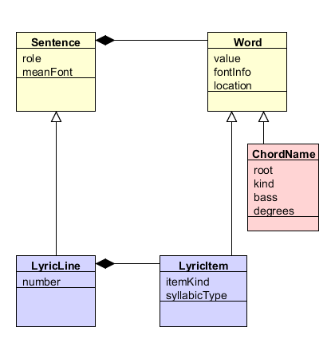

## Text
{: .no_toc }

Recognition of textual elements is delegated to Tesseract OCR library.  
This recognition is performed by the OMR engine (this is the TEXTS step).
It can also be performed manually on a provided glyph.

The resulting hierarchy of sentence and words can also be manually modified by the end-user.

---

## Table of contents
{: .no_toc .text-delta }

1. TOC
{:toc}

---

### TEXT step

The `TEXTS` step runs Tesseract OCR on the whole image and tries to assign each textual item its
probable content, type and role.

This engine step is influenced by three options available in the `Book parameters` menu:
- [x] Support for chord names
- [ ] Support for lyrics (assumed to be located below the related staff)
- [x] Support for lyrics even located above staff

Chord names and Lyrics are special items, this is the reason why their recognition must be
explicitly selected to avoid collateral damages of the OMR engine when they are not desired.

### Manual OCR

Tesseract OCR can also be launched manually on a glyph(s) selection by pressing one of two
buttons provided in the `Physicals` family of the shape palette:
* The `lyric` button,
* The `text` button.

There are two separate buttons because lyric items have a behavior significantly different from
plain text items, especially the gap between words can be much wider.
By choosing one button or the other, the user clearly specifies the desired result type of the
OCR operation.

### Sentence vs Words

A Sentence inter is an ensemble of one or several Word inter(s), as described in the following
class diagram:

* A **Word** handles its textual value and location.
  Word sub-classes (ChordName and LyricItem) handle additional data.  
  Word _value_ is modifiable by the end-user:  

  

* A **Sentence** is a sequence of words, it handles the sentence role.  
  (You can easily navigate from a selected word to its containing sentence via the `ToEnsemble` button).  
  Its textual content is defined as the concatenation of its word members.
  Sentence content is not modifiable directly, but rather via its word members.  
  Sentence _role_ is modifiable by the end-user.

  

### Plain Sentence

A sentence role can be set to any value in:
UnknownRole,
_Lyrics_,
_ChordName_,
Title,
Direction,
Number,
PartName,
Creator,
CreatorArranger,
CreatorComposer,
CreatorLyricist,
Rights,
EndingNumber,
EndingText.

A "plain" sentence is any sentence which is assigned a role different from ChordName and Lyrics.

Following an OCR recognition (OMR engine or manual OCR), the role of each resulting sentence is
determined by some heuristics.
In the case of manual OCR, the `lyric` button will always result in the _lyrics_ role,
whereas the `text` button will always result in a non _lyrics_ role.

Starting with 5.2 release, in all cases, the end-user can manually modify the sentence
role afterwards, from any role to any other role.

### Chord Name

A chord name is a musical symbol which names and describes the related chord.

Examples of chord names are: C, D7, F♯, B♭min, Em♭5, G6/B, Gdim, F♯m7, Em♭5, D7♯5, Am7♭5,
A(9), BMaj7/D♯, ...

**IMPORTANT NOTICE**:
As of this writing, Audiveris is not yet able to recognize chord names that include a sharp
 (``♯``) or a flat (``♭``) character.
Perhaps one day, we will succeed in training Tesseract OCR on this text content.  
For the time being, Audiveris is however able to recognize such chord names, when these
characters have been replaced (by an OCR "mistake", or by manual modification) by more "usual"
characters:
* ``'#'`` (number) as replacement for ``'♯'`` (sharp),
* ``'b'`` (lowercase b) as replacement for ``'♭'`` (flat).

When you OCR a chord name word, Audiveris may be able to decode it as a chord name and thus wrap
it within a chord name sentence.

If Audiveris was unsuccessful, you can still force the chord name role (at sentence level) and
type in the missing `b` or `#` characters if so needed (at word level).
The chord name will then be re-decoded on-the-fly with its new textual content.

### Lyric Line

A lyric line is a sentence composed of lyric items.

When selected, the inter board displays additional data:
* Voice number,
* Verse number,
* Location with respect to staff.

Each syllable (lyric item) is usually linked to a related chord.

If a syllable is not linked to the correct chord, you can modify this link manually by dragging
from the syllable to the suitable chord.
This will update on-the-fly the line data (voice, verse, location).
